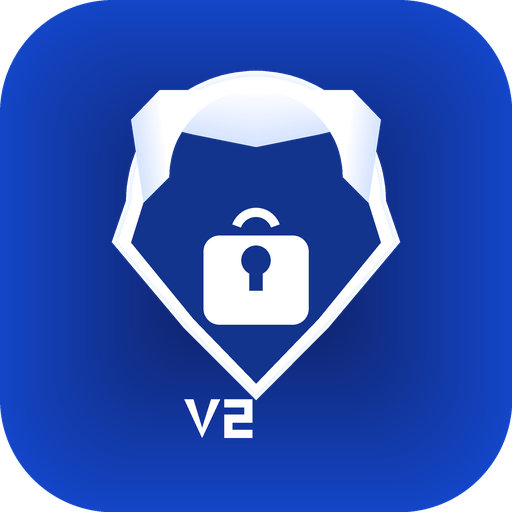

# V2Plug TV - Open Source Android TV VPN Client

<div align="center">



**🚀 Zero-Backend Android TV VPN Client | 零后端依赖的安卓电视 VPN 客户端**

[](LICENSE)
[](https://developer.android.com)
[](https://kotlinlang.org)
[](https://github.com/XTLS/Xray-core)

**🌐 官方网站 / Official Website:** [v2borad.haima.lol](http://v2borad.haima.lol)

[English](#english) | [中文](#chinese)

</div>

---

## <a id="chinese"></a>🇨🇳 中文文档

### 📖 项目简介

V2Plug TV 是一款专为 **Android TV / 电视盒子** 设计的开源 VPN 客户端，基于 Xray-core 构建。与传统 VPN 应用不同，它采用**零后端依赖**架构，所有配置通过手机端扫码推送，无需在电视上输入复杂信息。

**核心特性：**
- 🎯 **零后端依赖** - 无需服务器 API，数据由手机端推送
- 📱 **扫码配对** - 手机扫描电视二维码，一键完成配置
- 🎮 **遥控器优化** - 完整的 D-pad 焦点导航，TV 体验流畅
- 🔒 **本地存储** - 所有数据本地持久化，支持离线使用
- ⚡ **双引擎模式** - 自动检测设备能力，VPN/代理模式无缝切换
- 🌍 **多协议支持** - VMess, VLESS, Trojan, Shadowsocks 等

### 🎬 使用场景

- 在智能电视/盒子上观看 YouTube、Netflix 等流媒体
- 为 Android TV 游戏提供低延迟代理
- 家庭影院系统的网络加速
- 无需复杂配置，老人小孩也能轻松使用

### 🏗️ 技术架构

```
┌─────────────────────────────────────────┐
│           Android TV 应用                │
│  ┌──────────┐  ┌──────────┐  ┌────────┐ │
│  │ 二维码页  │  │  主页    │  │ 节点列表│ │
│  └────┬─────┘  └────┬─────┘  └───┬────┘ │
│       │              │            │      │
│  ┌────▼──────────────▼────────────▼────┐ │
│  │      本地 HTTP Server (8866)        │ │
│  │  /api/pair  /api/sync  /api/status │ │
│  └────────────────┬────────────────────┘ │
│                   │                      │
│  ┌────────────────▼────────────────────┐ │
│  │  Xray-core (libv2ray.aar)          │ │
│  │  VpnService / Tun2Socks            │ │
│  └────────────────────────────────────┘ │
└─────────────────────────────────────────┘
         ↕ 局域网 HTTP (WiFi)
┌─────────────────────────────────────────┐
│          手机端 APP (配套)               │
│  扫码 → 推送节点/订阅 → 远程控制         │
└─────────────────────────────────────────┘
```

**技术栈：**
- **语言**: Kotlin
- **UI 框架**: AndroidX Leanback (TV 专用)
- **VPN 核心**: Xray-core (gomobile)
- **HTTP Server**: NanoHTTPD
- **持久化**: DataStore
- **二维码**: ZXing

### 🚀 快速开始

#### 前置要求

- Android Studio Hedgehog (2023.1.1) 或更高版本
- Android SDK 24+ (Android 6.0+)
- Kotlin 1.9+
- 一台 Android TV 设备或模拟器

#### 编译步骤

```bash
# 1. 克隆仓库
git clone https://github.com/yourusername/v2plug-tv.git
cd v2plug-tv

# 2. 打开 Android Studio 导入项目

# 3. 构建 APK
./gradlew assembleRelease

# 4. 安装到 TV 设备
adb install -r app/build/outputs/apk/release/app-release.apk
```

#### 使用流程

1. **TV 端安装** - 在电视/盒子上安装 V2Plug TV APK
2. **显示二维码** - 打开应用，自动显示配对二维码
3. **手机扫码** - 使用配套手机 APP 扫描二维码
4. **推送配置** - 手机自动推送节点列表和订阅信息
5. **开始使用** - 遥控器选择节点，一键连接

### 📱 配套手机端

本项目是 TV 端开源版本，需要配合手机端使用。你可以：

1. **使用官方打包平台** - 访问 [V2Plug 打包平台](http://v2borad.haima.lol) 一键生成定制手机端
   - 支持自定义品牌、LOGO、主题色
   - Windows/Android 多平台支持
   - 云端构建，无需本地环境

2. **自行开发手机端** - 参考 [通信协议文档](docs/TV端开发文档.md#5-通信协议)
   - 实现 `/api/pair` 接口推送节点数据
   - 实现 `/api/sync` 接口同步更新
   - 实现 `/api/command` 接口远程控制

### 🎨 界面预览

**核心功能展示：**

📱 **扫码配对页面**
- TV 端显示二维码和局域网 IP
- 手机扫描后一键推送配置
- 无需在电视上输入复杂信息

🎮 **主页控制界面**
- 大圆形连接按钮，遥控器操作友好
- 实时显示连接状态、流量统计
- 代理模式切换（规则/全局）
- 订阅信息展示（套餐、到期时间、流量）

📦 **应用商店展示**
- Android TV 原生 Leanback UI
- 符合 Google Play TV 应用规范
- 完整的遥控器焦点导航

> 💡 **提示**：截图即将添加，敬请期待！如需查看实际效果，请访问 [V2Plug 打包平台](http://v2borad.haima.lol) 获取完整客户端。

### 🔧 核心功能

#### 1. 零后端架构
- TV 端不调用任何云端 API
- 所有数据通过局域网从手机推送
- 支持离线使用（配对后 7 天有效期）

#### 2. 双引擎模式
自动检测设备 VPN 能力，智能切换：
- **VPN 模式** - 全局流量劫持（TUN 接口）
- **代理模式** - 本地 SOCKS5/HTTP 代理（兼容阉割设备）

#### 3. 遥控器优化
- 完整的 D-pad 焦点导航
- 选中态视觉反馈
- 符合 TV 操作习惯的交互设计

#### 4. 数据同步
- 手动同步：主页右上角"同步"按钮
- 自动过期：7 天后提示重新扫码
- 实时状态：手机端可查询 TV 当前连接状态

### 📚 文档

- [完整开发文档](docs/TV端开发文档.md) - 架构设计、API 协议、UI 规范
- [核心代码参考](docs/附录-核心代码参考.md) - VPN 实现、配置生成
- [通信协议](docs/TV端开发文档.md#5-通信协议) - HTTP API 接口定义

### 🤝 贡献指南

欢迎提交 Issue 和 Pull Request！

**开发环境：**
```bash
# 安装依赖
./gradlew build

# 运行测试
./gradlew test

# 代码格式化
./gradlew ktlintFormat
```

**提交规范：**
- feat: 新功能
- fix: 修复 bug
- docs: 文档更新
- style: 代码格式调整
- refactor: 重构
- test: 测试相关

### 📄 开源协议

本项目采用 [MIT License](LICENSE) 开源协议。

### 🌟 Star History

[](https://star-history.com/#yourusername/v2plug-tv&Date)

### 💬 社区与支持

- **Telegram 群组**: [加入讨论](https://t.me/v2plug)
- **问题反馈**: [GitHub Issues](https://github.com/yourusername/v2plug-tv/issues)
- **官方网站**: [v2borad.haima.lol](http://v2borad.haima.lol)

### 🙏 致谢

- [Xray-core](https://github.com/XTLS/Xray-core) - 强大的代理核心
- [V2RayNG](https://github.com/2dust/v2rayNG) - Android VPN 实现参考
- [NanoHTTPD](https://github.com/NanoHttpd/nanohttpd) - 轻量级 HTTP Server

---

## <a id="english"></a>🇬🇧 English Documentation

### 📖 Introduction

V2Plug TV is an open-source VPN client designed specifically for **Android TV / TV Boxes**, built on Xray-core. Unlike traditional VPN apps, it adopts a **zero-backend architecture** where all configurations are pushed from a companion mobile app via QR code scanning, eliminating the need for complex input on TV.

**Key Features:**
- 🎯 **Zero Backend** - No server API required, data pushed from mobile
- 📱 **QR Pairing** - Scan TV QR code with phone, one-tap setup
- 🎮 **Remote Optimized** - Full D-pad navigation, smooth TV experience
- 🔒 **Local Storage** - All data persisted locally, offline support
- ⚡ **Dual Engine** - Auto-detect device capability, seamless VPN/Proxy switch
- 🌍 **Multi-Protocol** - VMess, VLESS, Trojan, Shadowsocks, etc.

### 🎬 Use Cases

- Watch YouTube, Netflix on Smart TV/Box
- Low-latency proxy for Android TV gaming
- Home theater network acceleration
- Easy setup for elderly and children

### 🏗️ Architecture

```
┌─────────────────────────────────────────┐
│         Android TV Application           │
│  ┌──────────┐  ┌──────────┐  ┌────────┐ │
│  │ QR Page  │  │   Home   │  │  Nodes │ │
│  └────┬─────┘  └────┬─────┘  └───┬────┘ │
│       │              │            │      │
│  ┌────▼──────────────▼────────────▼────┐ │
│  │   Local HTTP Server (Port 8866)    │ │
│  │  /api/pair  /api/sync  /api/status │ │
│  └────────────────┬────────────────────┘ │
│                   │                      │
│  ┌────────────────▼────────────────────┐ │
│  │  Xray-core (libv2ray.aar)          │ │
│  │  VpnService / Tun2Socks            │ │
│  └────────────────────────────────────┘ │
└─────────────────────────────────────────┘
         ↕ LAN HTTP (WiFi)
┌─────────────────────────────────────────┐
│      Mobile App (Companion)              │
│  Scan → Push Nodes/Sub → Remote Control │
└─────────────────────────────────────────┘
```

**Tech Stack:**
- **Language**: Kotlin
- **UI Framework**: AndroidX Leanback (TV-specific)
- **VPN Core**: Xray-core (gomobile)
- **HTTP Server**: NanoHTTPD
- **Persistence**: DataStore
- **QR Code**: ZXing

### 🚀 Quick Start

#### Prerequisites

- Android Studio Hedgehog (2023.1.1) or higher
- Android SDK 24+ (Android 6.0+)
- Kotlin 1.9+
- An Android TV device or emulator

#### Build Steps

```bash
# 1. Clone repository
git clone https://github.com/yourusername/v2plug-tv.git
cd v2plug-tv

# 2. Open in Android Studio

# 3. Build APK
./gradlew assembleRelease

# 4. Install to TV
adb install -r app/build/outputs/apk/release/app-release.apk
```

#### Usage Flow

1. **Install on TV** - Install V2Plug TV APK on your TV/Box
2. **Show QR Code** - Open app, QR code displays automatically
3. **Scan with Phone** - Use companion mobile app to scan
4. **Push Config** - Phone auto-pushes node list and subscription
5. **Start Using** - Select node with remote, one-tap connect

### 📱 Companion Mobile App

This is the open-source TV client. You need a companion mobile app:

1. **Use Official Platform** - Visit [V2Plug Platform](http://v2borad.haima.lol) to generate custom mobile app
   - Custom branding, logo, theme colors
   - Windows/Android multi-platform support
   - Cloud build, no local setup needed

2. **Build Your Own** - Refer to [Communication Protocol](docs/TV端开发文档.md#5-通信协议)
   - Implement `/api/pair` to push node data
   - Implement `/api/sync` for updates
   - Implement `/api/command` for remote control

### 📚 Documentation

- [Full Development Guide](docs/TV端开发文档.md) (Chinese)
- [Core Code Reference](docs/附录-核心代码参考.md) (Chinese)
- [API Protocol](docs/TV端开发文档.md#5-通信协议) (Chinese)

### 🤝 Contributing

Issues and Pull Requests are welcome!

**Development:**
```bash
# Install dependencies
./gradlew build

# Run tests
./gradlew test

# Format code
./gradlew ktlintFormat
```

**Commit Convention:**
- feat: New feature
- fix: Bug fix
- docs: Documentation
- style: Code formatting
- refactor: Refactoring
- test: Testing

### 📄 License

This project is licensed under the [MIT License](LICENSE).

### 💬 Community

- **Telegram**: [Join Discussion](https://t.me/v2plug)
- **Issues**: [GitHub Issues](https://github.com/yourusername/v2plug-tv/issues)
- **Website**: [v2borad.haima.lol](http://v2borad.haima.lol)

### 🙏 Acknowledgments

- [Xray-core](https://github.com/XTLS/Xray-core) - Powerful proxy core
- [V2RayNG](https://github.com/2dust/v2rayNG) - Android VPN reference
- [NanoHTTPD](https://github.com/NanoHttpd/nanohttpd) - Lightweight HTTP server

---

<div align="center">

**Made with ❤️ for Android TV Community**

[⬆ Back to Top](#v2plug-tv---open-source-android-tv-vpn-client)

</div>